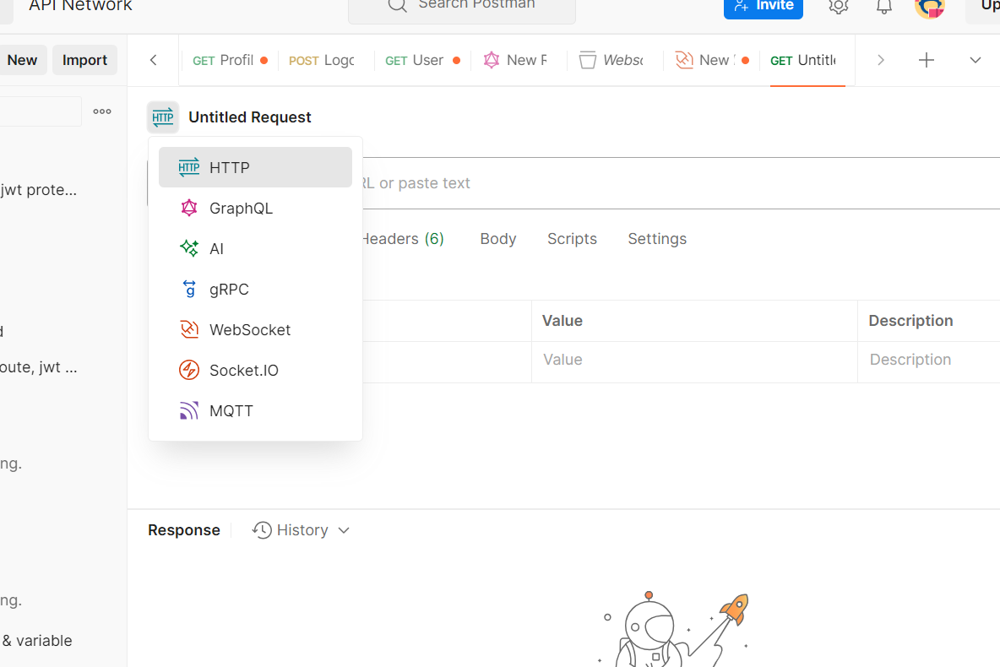
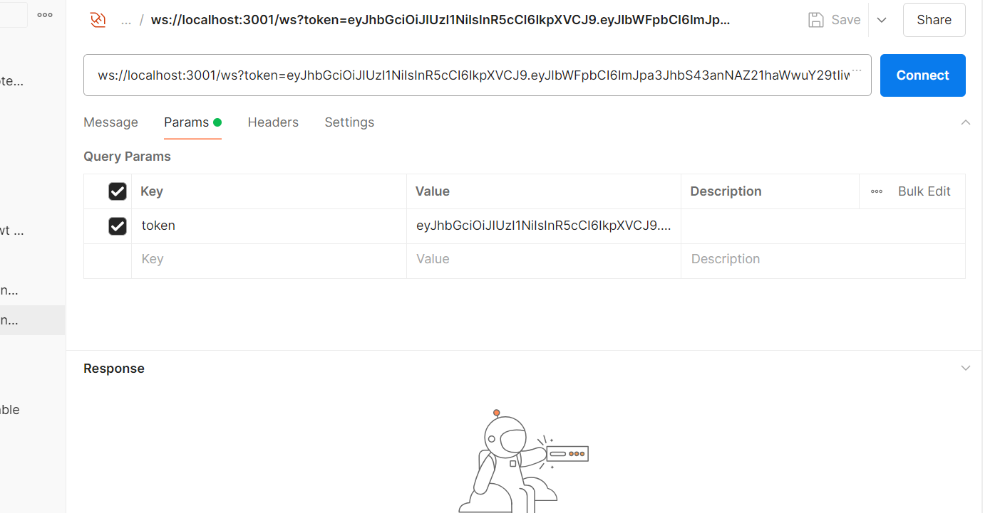
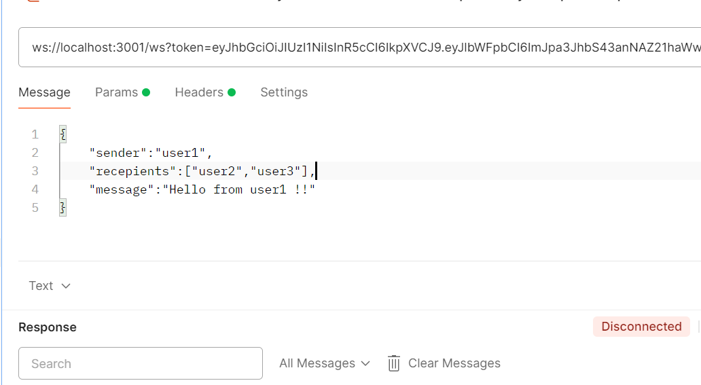
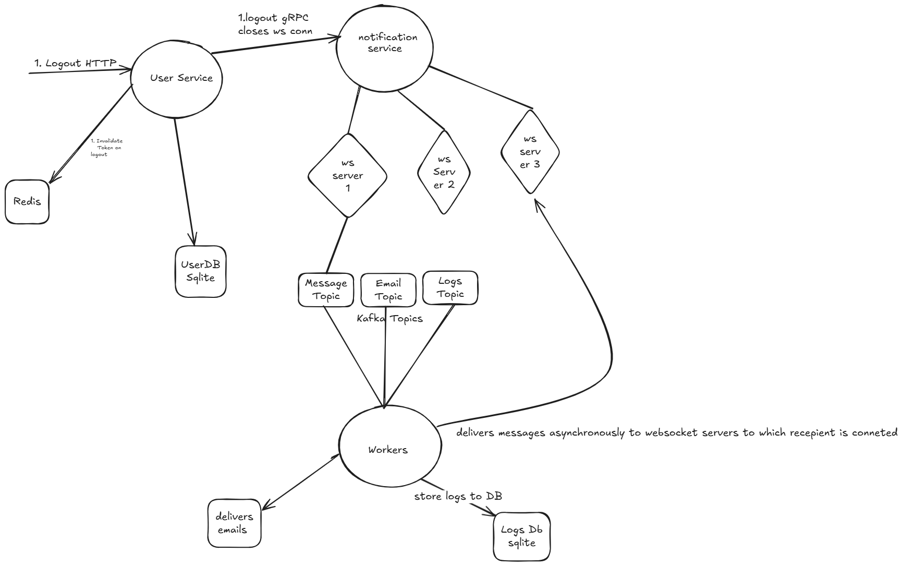

# ChatApp Microservices

This project is a microservices-based application for a chat application. It includes multiple services such as userservice, notificationservice, and workerservice. The project uses technologies like Redis, Kafka, gRPC, and Go Fiber.

## Features
1. User Authentication & Session Management
	•	Register (POST /register)
	•	Accepts email, password, and role (admin/user).
	•	Passwords must be hashed (bcrypt) before storage.
	•	Login (POST /login)
	•	Authenticates user, generates a JWT token, and starts a session.
	•	Logout (POST /logout)
	•	Invalidates the session and token.
	•	Get Profile (GET /profile)
	•	Returns user info (only accessible if authenticated).

2. Role-Based Access Control (RBAC)
	•	Admin-only route (GET /admin)
	•	Accessible only if role = admin.
	•	User-only routes (GET /user-data)
	•	Regular users cannot access admin endpoints.

3. Middleware Implementation
	•	JWT Authentication Middleware
	•	Ensures protected routes are accessible only with a valid token.
	•	Rate Limiting Middleware
	•	Limits the number of requests per user (e.g., 100 requests per minute).
	•	Request Logging Middleware
	•	Logs request details (method, path, response time, and user ID).

4. WebSockets for Real-time Notifications
	•	Implement a WebSocket server (/ws) that sends real-time notifications to authenticated users.
	•	Users receive a “Welcome back” message upon login via WebSocket.
	•	Implement a global chat feature, allowing users to send messages to connected users.

5. Background Job Processing (Worker Queue)
	•	Implement a background worker (e.g., using NATS, RabbitMQ, or Kafka) to process:
	•	Email notifications when a new user registers.
	•	Asynchronous log processing (store logs in a DB).
	•	Message queuing for sending WebSocket notifications without blocking the main server.

6. API Monitoring & Performance Optimization
	•	Implement Prometheus metrics for tracking request latency and API usage.
	•	Add structured logging with Zap or Logrus.
	•	Optimize for high concurrency using Go routines effectively.

## Services

1. **userservice**:
   - Handles user registration, login, profile management, and logout

2. **notificationservice**:
   - Handles sending notifications to users.

3. **workerservice**:
   - Performs background tasks and processes events from Kafka.

## Prerequisites , Please ensure Docker and Postman are already install on system.

## Running the Services , cd to root of project
1. docker-compose -f docker-compose-kafka.yml up
2. docker-compose -f docker-compose.yml up

## Import Postman collections 
1. Open Postman
2. Import collections sent along with email by clicking Import button on top left side. 
3. Request Data is present for required POST APIs.

## API Endpoints
1. POST http://localhost:3000/api/v1/register: Register a new user.
   Eg. Request data 
   {
    "id":"user1",
    "email":"bikram.7js@gmail.com",
    "password":"123",
    "role":"user"
   }

   Registers user to systems and sends registration email to mentioned mail.

2. POST http://localhost:3000/api/v1/login: Login a user. 
   Eg. Request data 
   {
    "id":"user1",
    "email":"bikram.7js@gmail.com",
    "password":"123",
    "role":"user"
   }

   Logs in the user and generates jwt token . Please keep the token handy for subsequent requests.

3. POST http://localhost:3000/api/v1/logout: Logout a user.
   Please Ensure  jwt token  is provided
   Eg. Request Body
   {
	"id":"user1"
   }
   Logs out a user and invalidates the token.

4. GET http://localhost:3000/api/v1/admin: Get users with user role . Only accessible by admin users.
   Ensure correct jwt token generated by admin is provided.

5. GET http://localhost:3000/api/v1/user-data/:userID: Get user data by ID. 
   Eg. Request URL
   http://localhost:3000/api/v1/user-data/user1
   Ensure userId is given as a param in URL with jwt token in Authorization header

6. GET http://localhost:3000/api/v1/profile: Get user profile.
   Eg. Req URL http://localhost:3000/api/v1/profile?id=user3
   Please ensure userid is given as query param with jwt in Authorization Header .Accessible by both admin and user roles.

7. Get app Metrics
   http://localhost:3000/metrics
## Websocket Service

1. Open new request Tab and select websocket from the list
 

enter URL:  ws://localhost:3001/ws?token=abc...
 Please Give token Under Params and check box
   and press Connect
   Eg
   

   
   To send messages Use this format in Message box
   {
    "sender":"user1",
    "recepients":["user2","user3"],
    "message":"Hello from user1 !!"
   }
   
   Message can sent to single user or to multiple connected users.

## Changing Service Configurations
1. To change rate limit config (or any other configuration)go to config file in this case /userservice/config and modify MAXReqPerUser in 1 minute window
2. Rebuild services using docker-compose -f docker-compose.yml build --no-cache 
3. docker-compose -f docker-compose.yml up to deploy 

## High Level Design

 Imp flows
1. On Logout userservice invalidates the token by storing it in redis. A gRPC call to notification service to disconnect user if connected.
2. User sends message to Notificationservice via websocket which is then pushed to kafka.Worker process these messages and makes a gRPC call back to notification service then messaged is pushed to the user via websocket.
3. On Registration email event is pushed to queue which is picked up by worker and sends a registration email to user.   

  